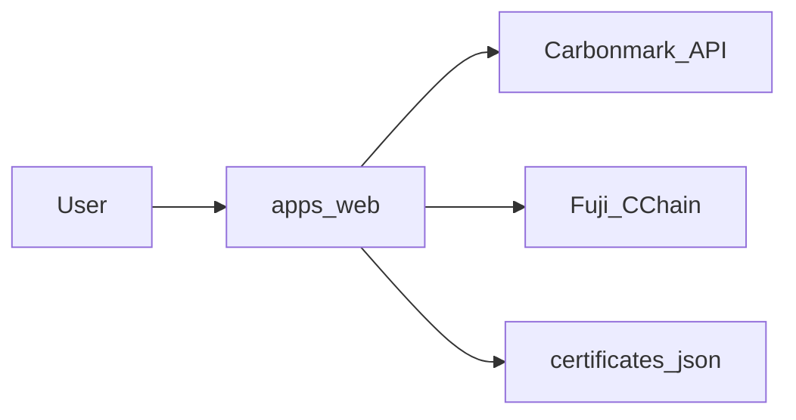

# rwa-carbon-offset

Measure AI emissions → retire verified Carbonmark credits → Avalanche Fuji C-Chain receipt.

**Live demo:** https://rwa-carbon-offset.vercel.app

## Acknowledgments

Built for [Protocol Camp](https://www.protocolcamp.com).

Thanks to [Avalanche Team1 (Thailand)](https://www.team1.network) for ecosystem support. Team1 Thailand does not have a separate website — credit goes to the community and the global Team1 network at [team1.network](https://www.team1.network).

**Team**

- [@ktsukixb](https://x.com/ktsukixb)
- [@101beere](https://x.com/101beere)

## What it does

1. **Estimate** — model + usage → gCO₂e range (v0 factors, batched to 0.001 t minimum)
2. **Retire** — real Carbonmark sandbox retirement via verified credits
3. **Certificate** — public page with Carbonmark URL + optional Fuji C-Chain receipt on Snowtrace

This is **not** an Avalanche L1. The smart contract lives on Fuji C-Chain (chain ID 43113) and stores the **receipt**, not the retirement itself.

## Current status (Phase 1b — demo-ready)

| Area | Status |
|------|--------|
| Web flow | `/` → `/estimate` → `/checkout` → `/certificate/[id]` |
| Carbonmark | Sandbox retire works (API key in env) |
| Fuji C-Chain | `CertificateReceipt` deployed + `record()` on checkout |
| E2E | `npm run e2e:demo` passes with Carbonmark + Snowtrace links |
| Production | https://rwa-carbon-offset.vercel.app |

**On-chain proof (Fuji testnet)**

- Contract: `0x9dd6ae803cab0bd07b4cbc09fab3bc30f7357cc1`
- [Snowtrace contract](https://testnet.snowtrace.io/address/0x9dd6ae803cab0bd07b4cbc09fab3bc30f7357cc1)
- [Deploy tx](https://testnet.snowtrace.io/tx/0xf8359adacc9a3618eb9a39e8263fcd66f940e93e775c4966124b25dee2c633b2)

**Honest limitations**

- Emissions use a v0 approximation in `packages/core/src/emissions.ts` — not EcoLogits yet
- The “Emissions by model class” chart on the landing page is illustrative
- Certificates are stored in a local file (`apps/web/.data/`) and do not persist across Vercel redeploys
- Checkout is a Phase-1 shortcut (no Stripe) — sandbox Carbonmark key only

## What's next

| Priority | Item |
|----------|------|
| 1 | Persistent certificate store (DB / Vercel KV) |
| 2 | EcoLogits-backed emissions (replace v0 factors) |
| 3 | Klima x402 retire rail (optional) |
| 4 | Stripe checkout + production Carbonmark key |
| 5 | Wire all landing stats and charts from real data |

## Architecture



**Key paths**

- Estimate: `packages/core/src/emissions.ts`
- Retire + Fuji: `apps/web/app/api/offset/route.ts` → `packages/retirement/src/carbonmark.ts` → `spike/deploy-receipt.ts`
- Certificates: `apps/web/lib/certificates.ts`

## Quick start

```bash
cp .env.example .env
# Add CARBONMARK_API_KEY — never commit .env
cp .env apps/web/.env.local
npm install
npm run dev
```

Open http://localhost:3000

End-to-end check (dev server running, Fuji env optional for Snowtrace):

```bash
npm run e2e:demo
# if port 3000 is busy: E2E_BASE_URL=http://localhost:3001 npm run e2e:demo
```

**2-minute pitch script:** see [DEMO.md](DEMO.md)

### Fuji contract (optional)

```bash
npm run compile:contract
# Fund a Fuji wallet, set FUJI_PRIVATE_KEY in .env
npm run deploy:fuji
# Set CERTIFICATE_RECEIPT_ADDRESS in .env and apps/web/.env.local
```

Faucet: https://core.app/tools/testnet-faucet/?subnet=c&token=c

Snowtrace: https://testnet.snowtrace.io

## Demo talking points

1. One AI query is ~0.03–3 gCO₂e; the on-chain minimum is 1 kg — we batch, we do not retire per prompt.
2. Real retirement is Carbonmark (verified credits). Avalanche stores the **receipt**.
3. C-Chain is the EVM contract chain. We did not launch a custom L1.
